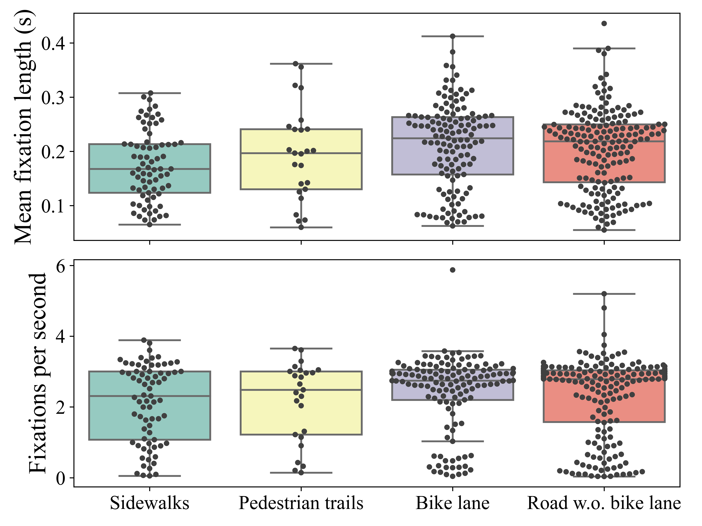
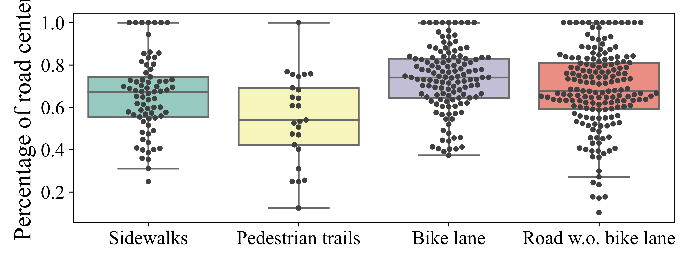
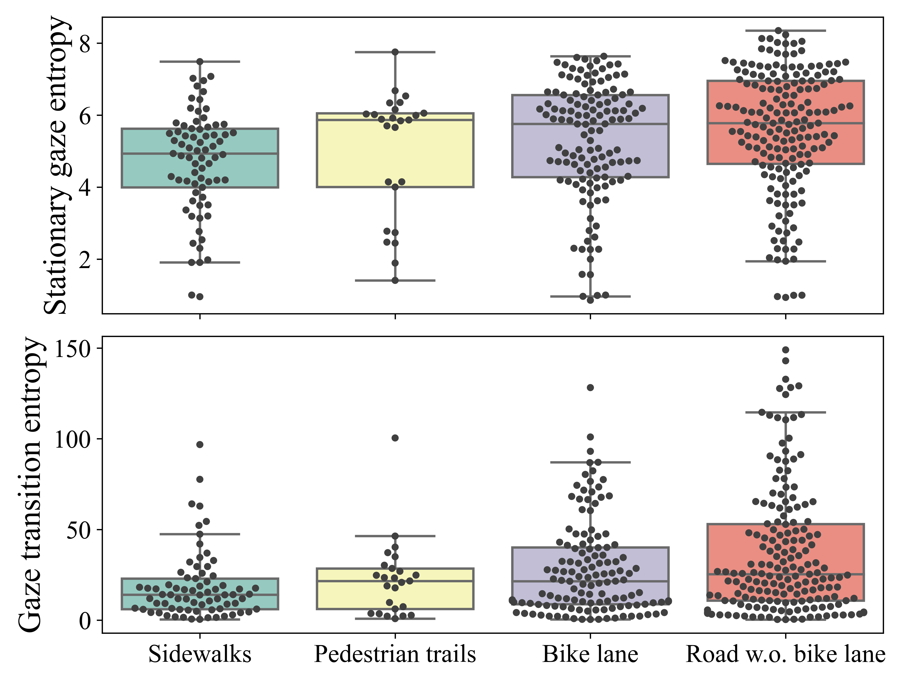
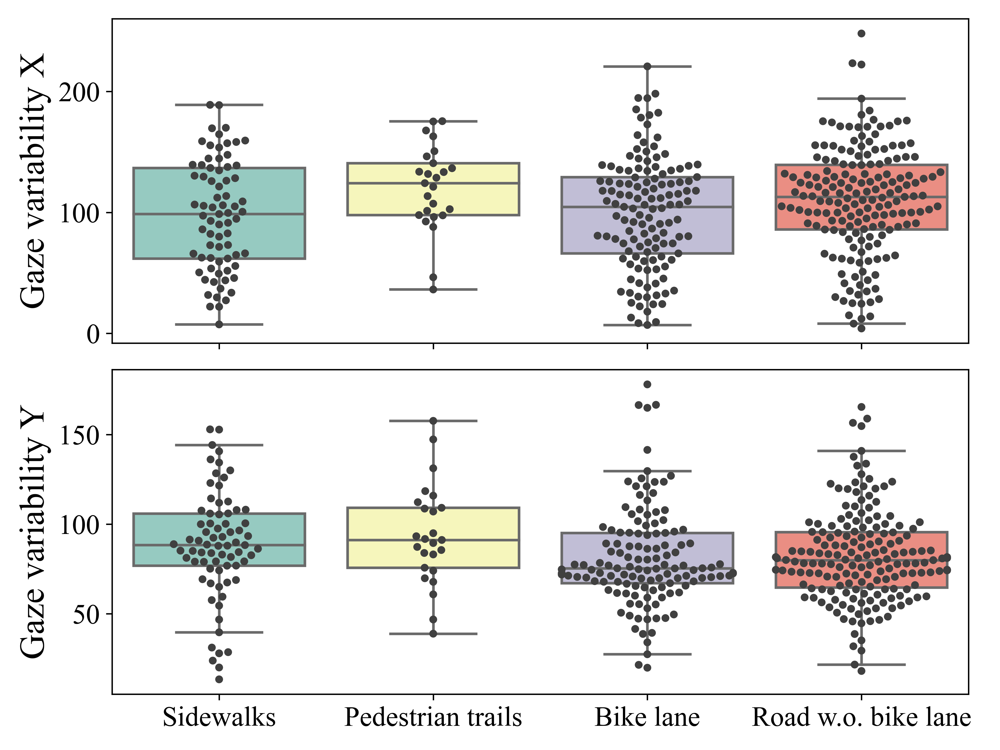

# Escooter_ITSC
This repo contains the codes for our submission to IEEE ITSC'24: **Impact of Different Infrastructures and Traffic Scenarios on Behavioral and Physiological Responses of E-scooter Users**

## Installation
- create a python virtual environment: `conda create -n scooter python=3.8 -y`
- active the virtul environment: `conda activate scooter`
- install the requirements: `pip install -r requirements.txt`

## Gaze Density Maps
1. propocess the gaze data via: `python generate_whole_excel_facilities.py`
2. plot the gaze density map via: `python plot_gaze_density_facilities.py`

Fixation Metrics:
<table>
<tr>
  <td>
    

      
       
      <em>Fixation metrics</em>
    

  </td>
  <td>
    

      
       
      <em>PRC metric</em>
    

  </td>
</tr>
</table>

Entropy Metrics:
<table>
<tr>
  <td>
    

      
       
      <em>Gaze entropy metrics</em>
    

  </td>
  <td>
    

      
       
      <em>Gaze Variability metric</em>
    

  </td>
</tr>
</table>

## Citation
Coming soon...